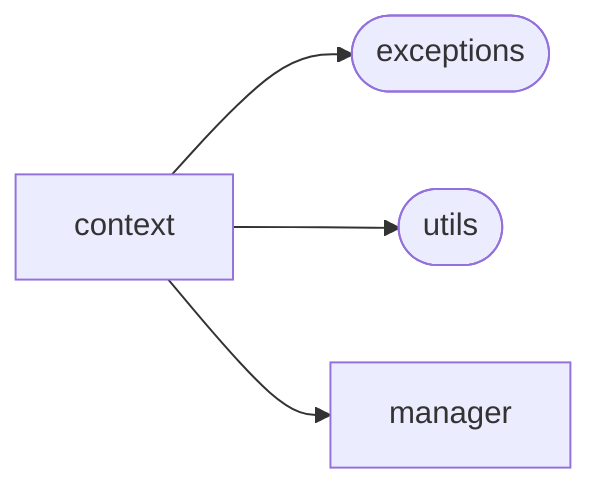

# Aiogram Dialog Context

[_Documentation generated by Documatic_](https://www.documatic.com)

<!---Documatic-section-Codebase Structure-start--->
## Codebase Structure

<!---Documatic-block-system_architecture-start--->

<!---Documatic-block-system_architecture-end--->

# #
<!---Documatic-section-Codebase Structure-end--->

<!---Documatic-section-aiogram_dialog.context.intent_filter.context_saver_middleware-start--->
## aiogram_dialog.context.intent_filter.context_saver_middleware

<!---Documatic-section-context_saver_middleware-start--->
<!---Documatic-block-aiogram_dialog.context.intent_filter.context_saver_middleware-start--->
<details>
	<summary><code>aiogram_dialog.context.intent_filter.context_saver_middleware</code> code snippet</summary>

```python
async def context_saver_middleware(handler, event, data):
    result = await handler(event, data)
    proxy: StorageProxy = data.pop(STORAGE_KEY, None)
    if proxy:
        await proxy.save_context(data.pop(CONTEXT_KEY))
        await proxy.save_stack(data.pop(STACK_KEY))
    return result
```
</details>
<!---Documatic-block-aiogram_dialog.context.intent_filter.context_saver_middleware-end--->
<!---Documatic-section-context_saver_middleware-end--->

# #
<!---Documatic-section-aiogram_dialog.context.intent_filter.context_saver_middleware-end--->

<!---Documatic-section-aiogram_dialog.context.events.StartMode-start--->
## aiogram_dialog.context.events.StartMode

<!---Documatic-section-StartMode-start--->
<!---Documatic-block-aiogram_dialog.context.events.StartMode-start--->
<details>
	<summary><code>aiogram_dialog.context.events.StartMode</code> code snippet</summary>

```python
class StartMode(Enum):
    NORMAL = 'NORMAL'
    RESET_STACK = 'RESET_STACK'
    NEW_STACK = 'NEW_STACK'
```
</details>
<!---Documatic-block-aiogram_dialog.context.events.StartMode-end--->
<!---Documatic-section-StartMode-end--->

# #
<!---Documatic-section-aiogram_dialog.context.events.StartMode-end--->

<!---Documatic-section-aiogram_dialog.context.events.ShowMode-start--->
## aiogram_dialog.context.events.ShowMode

<!---Documatic-section-ShowMode-start--->
<!---Documatic-block-aiogram_dialog.context.events.ShowMode-start--->
<details>
	<summary><code>aiogram_dialog.context.events.ShowMode</code> code snippet</summary>

```python
class ShowMode(Enum):
    AUTO = 'auto'
    EDIT = 'edit'
    SEND = 'send'
```
</details>
<!---Documatic-block-aiogram_dialog.context.events.ShowMode-end--->
<!---Documatic-section-ShowMode-end--->

# #
<!---Documatic-section-aiogram_dialog.context.events.ShowMode-end--->

[_Documentation generated by Documatic_](https://www.documatic.com)