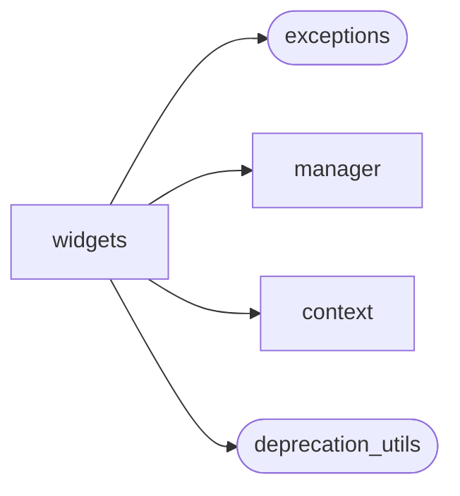
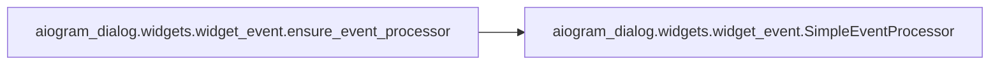
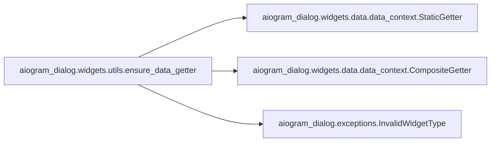
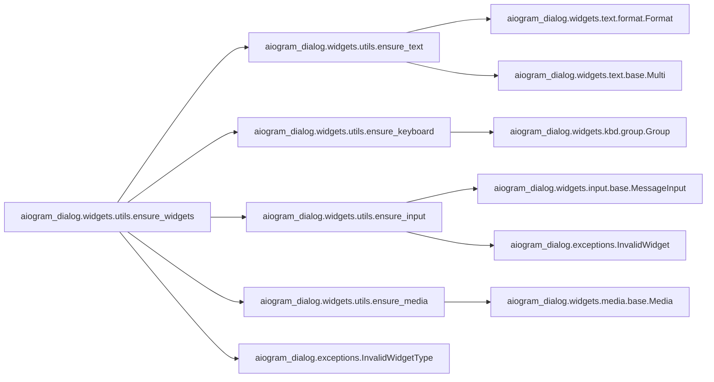
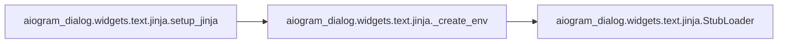
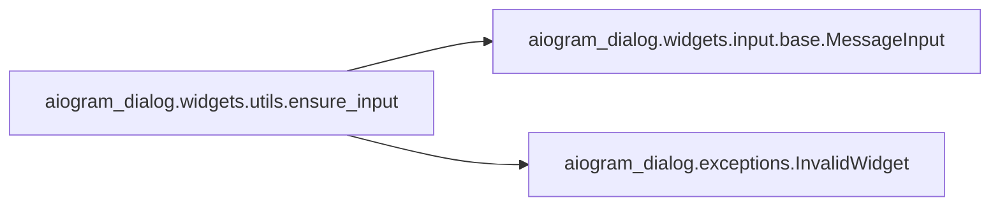
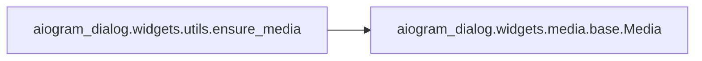
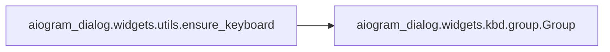
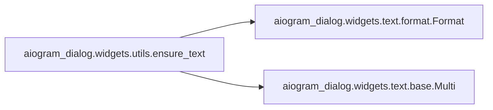
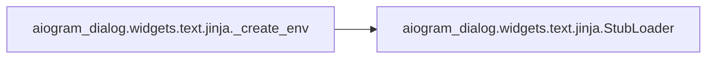

# Aiogram Dialog Widgets

[_Documentation generated by Documatic_](https://www.documatic.com)

<!---Documatic-section-Codebase Structure-start--->
## Codebase Structure

<!---Documatic-block-system_architecture-start--->

<!---Documatic-block-system_architecture-end--->

# #
<!---Documatic-section-Codebase Structure-end--->

<!---Documatic-section-aiogram_dialog.widgets.widget_event.ensure_event_processor-start--->
## aiogram_dialog.widgets.widget_event.ensure_event_processor

<!---Documatic-section-ensure_event_processor-start--->


### Object Calls

* aiogram_dialog.widgets.widget_event.SimpleEventProcessor

<!---Documatic-block-aiogram_dialog.widgets.widget_event.ensure_event_processor-start--->
<details>
	<summary><code>aiogram_dialog.widgets.widget_event.ensure_event_processor</code> code snippet</summary>

```python
def ensure_event_processor(processor: Union[Callable, WidgetEventProcessor, None]) -> WidgetEventProcessor:
    if isinstance(processor, WidgetEventProcessor):
        return processor
    else:
        return SimpleEventProcessor(processor)
```
</details>
<!---Documatic-block-aiogram_dialog.widgets.widget_event.ensure_event_processor-end--->
<!---Documatic-section-ensure_event_processor-end--->

# #
<!---Documatic-section-aiogram_dialog.widgets.widget_event.ensure_event_processor-end--->

<!---Documatic-section-aiogram_dialog.widgets.utils.ensure_data_getter-start--->
## aiogram_dialog.widgets.utils.ensure_data_getter

<!---Documatic-section-ensure_data_getter-start--->


### Object Calls

* aiogram_dialog.widgets.data.data_context.StaticGetter
* aiogram_dialog.widgets.data.data_context.CompositeGetter
* aiogram_dialog.exceptions.InvalidWidgetType

<!---Documatic-block-aiogram_dialog.widgets.utils.ensure_data_getter-start--->
<details>
	<summary><code>aiogram_dialog.widgets.utils.ensure_data_getter</code> code snippet</summary>

```python
def ensure_data_getter(getter: GetterVariant) -> DataGetter:
    if isinstance(getter, Callable):
        return getter
    elif isinstance(getter, dict):
        return StaticGetter(getter)
    elif isinstance(getter, (list, tuple)):
        return CompositeGetter(*map(ensure_data_getter, getter))
    elif getter is None:
        return StaticGetter({})
    else:
        raise InvalidWidgetType(f'Cannot add data getter of type {type(getter)}. Only Dict, Callable or List of Callables are supported')
```
</details>
<!---Documatic-block-aiogram_dialog.widgets.utils.ensure_data_getter-end--->
<!---Documatic-section-ensure_data_getter-end--->

# #
<!---Documatic-section-aiogram_dialog.widgets.utils.ensure_data_getter-end--->

<!---Documatic-section-aiogram_dialog.widgets.utils.ensure_widgets-start--->
## aiogram_dialog.widgets.utils.ensure_widgets

<!---Documatic-section-ensure_widgets-start--->


### Object Calls

* aiogram_dialog.widgets.utils.ensure_text
* aiogram_dialog.widgets.utils.ensure_keyboard
* aiogram_dialog.widgets.utils.ensure_input
* aiogram_dialog.widgets.utils.ensure_media
* aiogram_dialog.exceptions.InvalidWidgetType

<!---Documatic-block-aiogram_dialog.widgets.utils.ensure_widgets-start--->
<details>
	<summary><code>aiogram_dialog.widgets.utils.ensure_widgets</code> code snippet</summary>

```python
def ensure_widgets(widgets: Sequence[WidgetSrc]) -> Tuple[Text, Keyboard, BaseInput, Media]:
    texts = []
    keyboards = []
    inputs = []
    media = []
    for w in widgets:
        if isinstance(w, (str, Text)):
            texts.append(ensure_text(w))
        elif isinstance(w, Keyboard):
            keyboards.append(ensure_keyboard(w))
        elif isinstance(w, (BaseInput, Callable)):
            inputs.append(ensure_input(w))
        elif isinstance(w, Media):
            media.append(ensure_media(w))
        else:
            raise InvalidWidgetType(f'Cannot add widget of type {type(w)}. Only str, Text, Keyboard, BaseInput and Callable are supported')
    return (ensure_text(texts), ensure_keyboard(keyboards), ensure_input(inputs), ensure_media(media))
```
</details>
<!---Documatic-block-aiogram_dialog.widgets.utils.ensure_widgets-end--->
<!---Documatic-section-ensure_widgets-end--->

# #
<!---Documatic-section-aiogram_dialog.widgets.utils.ensure_widgets-end--->

<!---Documatic-section-aiogram_dialog.widgets.when.true-start--->
## aiogram_dialog.widgets.when.true

<!---Documatic-section-true-start--->
<!---Documatic-block-aiogram_dialog.widgets.when.true-start--->
<details>
	<summary><code>aiogram_dialog.widgets.when.true</code> code snippet</summary>

```python
def true(data: Dict, widget: 'Whenable', manager: DialogManager):
    return True
```
</details>
<!---Documatic-block-aiogram_dialog.widgets.when.true-end--->
<!---Documatic-section-true-end--->

# #
<!---Documatic-section-aiogram_dialog.widgets.when.true-end--->

<!---Documatic-section-aiogram_dialog.widgets.text.jinja.setup_jinja-start--->
## aiogram_dialog.widgets.text.jinja.setup_jinja

<!---Documatic-section-setup_jinja-start--->


### Object Calls

* aiogram_dialog.widgets.text.jinja._create_env

<!---Documatic-block-aiogram_dialog.widgets.text.jinja.setup_jinja-start--->
<details>
	<summary><code>aiogram_dialog.widgets.text.jinja.setup_jinja</code> code snippet</summary>

```python
def setup_jinja(bot: Bot, *args: Any, filters: Optional[Filters]=None, **kwargs: Any) -> Environment:
    env = _create_env(*args, filters=filters, **kwargs)
    setattr(bot, BOT_ENV_FIELD, env)
    return env
```
</details>
<!---Documatic-block-aiogram_dialog.widgets.text.jinja.setup_jinja-end--->
<!---Documatic-section-setup_jinja-end--->

# #
<!---Documatic-section-aiogram_dialog.widgets.text.jinja.setup_jinja-end--->

<!---Documatic-section-aiogram_dialog.widgets.utils.ensure_input-start--->
## aiogram_dialog.widgets.utils.ensure_input

<!---Documatic-section-ensure_input-start--->


### Object Calls

* aiogram_dialog.widgets.input.base.MessageInput
* aiogram_dialog.exceptions.InvalidWidget

<!---Documatic-block-aiogram_dialog.widgets.utils.ensure_input-start--->
<details>
	<summary><code>aiogram_dialog.widgets.utils.ensure_input</code> code snippet</summary>

```python
def ensure_input(widget: Union[MessageHandlerFunc, WidgetEventProcessor, BaseInput, Sequence[BaseInput]]) -> BaseInput:
    if isinstance(widget, BaseInput):
        return widget
    elif isinstance(widget, Sequence):
        if len(widget) == 0:
            return MessageInput(None)
        elif len(widget) == 1:
            return widget[0]
        else:
            raise InvalidWidget(f'Only 1 input supported, got {len(widget)}')
    else:
        return MessageInput(widget)
```
</details>
<!---Documatic-block-aiogram_dialog.widgets.utils.ensure_input-end--->
<!---Documatic-section-ensure_input-end--->

# #
<!---Documatic-section-aiogram_dialog.widgets.utils.ensure_input-end--->

<!---Documatic-section-aiogram_dialog.widgets.utils.ensure_media-start--->
## aiogram_dialog.widgets.utils.ensure_media

<!---Documatic-section-ensure_media-start--->


### Object Calls

* aiogram_dialog.widgets.media.base.Media

<!---Documatic-block-aiogram_dialog.widgets.utils.ensure_media-start--->
<details>
	<summary><code>aiogram_dialog.widgets.utils.ensure_media</code> code snippet</summary>

```python
def ensure_media(widget: Union[Media, Sequence[Media]]) -> Media:
    if isinstance(widget, Media):
        return widget
    if len(widget) > 1:
        raise ValueError('Only one media widget is supported')
    if len(widget) == 1:
        return widget[0]
    return Media()
```
</details>
<!---Documatic-block-aiogram_dialog.widgets.utils.ensure_media-end--->
<!---Documatic-section-ensure_media-end--->

# #
<!---Documatic-section-aiogram_dialog.widgets.utils.ensure_media-end--->

<!---Documatic-section-aiogram_dialog.widgets.data.data_context.CompositeGetter-start--->
## aiogram_dialog.widgets.data.data_context.CompositeGetter

<!---Documatic-section-CompositeGetter-start--->
<!---Documatic-block-aiogram_dialog.widgets.data.data_context.CompositeGetter-start--->
<details>
	<summary><code>aiogram_dialog.widgets.data.data_context.CompositeGetter</code> code snippet</summary>

```python
class CompositeGetter:

    def __init__(self, *getters: DataGetter):
        self.getters: List[DataGetter] = list(getters)

    async def __call__(self, **kwargs):
        data = {}
        for g in self.getters:
            data.update(await g(**kwargs))
        return data
```
</details>
<!---Documatic-block-aiogram_dialog.widgets.data.data_context.CompositeGetter-end--->
<!---Documatic-section-CompositeGetter-end--->

# #
<!---Documatic-section-aiogram_dialog.widgets.data.data_context.CompositeGetter-end--->

<!---Documatic-section-aiogram_dialog.widgets.widget_event.SimpleEventProcessor-start--->
## aiogram_dialog.widgets.widget_event.SimpleEventProcessor

<!---Documatic-section-SimpleEventProcessor-start--->
<!---Documatic-block-aiogram_dialog.widgets.widget_event.SimpleEventProcessor-start--->
<details>
	<summary><code>aiogram_dialog.widgets.widget_event.SimpleEventProcessor</code> code snippet</summary>

```python
class SimpleEventProcessor(WidgetEventProcessor):

    def __init__(self, callback: Callable):
        self.callback = callback

    async def process_event(self, event: ChatEvent, source: Any, manager: DialogManager, *args, **kwargs):
        if self.callback:
            await self.callback(event, source, manager, *args, **kwargs)
```
</details>
<!---Documatic-block-aiogram_dialog.widgets.widget_event.SimpleEventProcessor-end--->
<!---Documatic-section-SimpleEventProcessor-end--->

# #
<!---Documatic-section-aiogram_dialog.widgets.widget_event.SimpleEventProcessor-end--->

<!---Documatic-section-aiogram_dialog.widgets.utils.ensure_keyboard-start--->
## aiogram_dialog.widgets.utils.ensure_keyboard

<!---Documatic-section-ensure_keyboard-start--->


### Object Calls

* aiogram_dialog.widgets.kbd.group.Group

<!---Documatic-block-aiogram_dialog.widgets.utils.ensure_keyboard-start--->
<details>
	<summary><code>aiogram_dialog.widgets.utils.ensure_keyboard</code> code snippet</summary>

```python
def ensure_keyboard(widget: Union[Keyboard, Sequence[Keyboard]]) -> Keyboard:
    if isinstance(widget, Sequence):
        if len(widget) == 1:
            return widget[0]
        return Group(*widget)
    return widget
```
</details>
<!---Documatic-block-aiogram_dialog.widgets.utils.ensure_keyboard-end--->
<!---Documatic-section-ensure_keyboard-end--->

# #
<!---Documatic-section-aiogram_dialog.widgets.utils.ensure_keyboard-end--->

<!---Documatic-section-aiogram_dialog.widgets.data.data_context.StaticGetter-start--->
## aiogram_dialog.widgets.data.data_context.StaticGetter

<!---Documatic-section-StaticGetter-start--->
<!---Documatic-block-aiogram_dialog.widgets.data.data_context.StaticGetter-start--->
<details>
	<summary><code>aiogram_dialog.widgets.data.data_context.StaticGetter</code> code snippet</summary>

```python
class StaticGetter:

    def __init__(self, data: Dict):
        self.data = data

    async def __call__(self, **kwargs):
        return self.data
```
</details>
<!---Documatic-block-aiogram_dialog.widgets.data.data_context.StaticGetter-end--->
<!---Documatic-section-StaticGetter-end--->

# #
<!---Documatic-section-aiogram_dialog.widgets.data.data_context.StaticGetter-end--->

<!---Documatic-section-aiogram_dialog.widgets.utils.ensure_text-start--->
## aiogram_dialog.widgets.utils.ensure_text

<!---Documatic-section-ensure_text-start--->


### Object Calls

* aiogram_dialog.widgets.text.format.Format
* aiogram_dialog.widgets.text.base.Multi

<!---Documatic-block-aiogram_dialog.widgets.utils.ensure_text-start--->
<details>
	<summary><code>aiogram_dialog.widgets.utils.ensure_text</code> code snippet</summary>

```python
def ensure_text(widget: Union[str, Text, Sequence[Text]]) -> Text:
    if isinstance(widget, str):
        return Format(widget)
    if isinstance(widget, Sequence):
        if len(widget) == 1:
            return widget[0]
        return Multi(*widget)
    return widget
```
</details>
<!---Documatic-block-aiogram_dialog.widgets.utils.ensure_text-end--->
<!---Documatic-section-ensure_text-end--->

# #
<!---Documatic-section-aiogram_dialog.widgets.utils.ensure_text-end--->

<!---Documatic-section-aiogram_dialog.widgets.text.jinja._create_env-start--->
## aiogram_dialog.widgets.text.jinja._create_env

<!---Documatic-section-_create_env-start--->


### Object Calls

* aiogram_dialog.widgets.text.jinja.StubLoader

<!---Documatic-block-aiogram_dialog.widgets.text.jinja._create_env-start--->
<details>
	<summary><code>aiogram_dialog.widgets.text.jinja._create_env</code> code snippet</summary>

```python
def _create_env(*args: Any, filters: Optional[Filters]=None, **kwargs: Any) -> Environment:
    kwargs.setdefault('autoescape', True)
    kwargs.setdefault('lstrip_blocks', True)
    kwargs.setdefault('trim_blocks', True)
    if 'loader' not in kwargs:
        kwargs['loader'] = StubLoader()
    env = Environment(*args, **kwargs)
    if filters is not None:
        env.filters.update(filters)
    return env
```
</details>
<!---Documatic-block-aiogram_dialog.widgets.text.jinja._create_env-end--->
<!---Documatic-section-_create_env-end--->

# #
<!---Documatic-section-aiogram_dialog.widgets.text.jinja._create_env-end--->

[_Documentation generated by Documatic_](https://www.documatic.com)