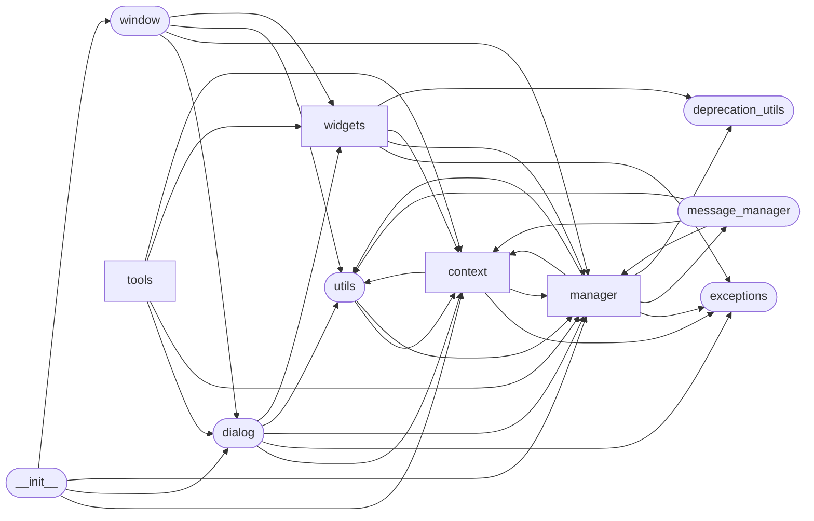

# Code Overview

[_Documentation generated by Documatic_](https://www.documatic.com)

<!---Documatic-section-Codebase Structure Python-start--->
## Codebase Structure Python

The codebase has a 2-deep folder structure,
                with 58 code files in total.

<!---Documatic-block-system_architecture-start--->

<!---Documatic-block-system_architecture-end--->

# #
<!---Documatic-section-Codebase Structure Python-end--->

<!---Documatic-section-Key Infrastructure-start--->
## Key Infrastructure

### MongoDB is used in:

* `find` of `aiogram_dialog.manager.dialog.ManagedDialogAdapter`
* `find` of `aiogram_dialog.widgets.kbd.group.Group`

# #
<!---Documatic-section-Key Infrastructure-end--->

<!---Documatic-section-Key Objects-start--->
## Key Objects

There are exposed imports at level-0
from the source directory (aiogram_dialog)

<!---Documatic-block-aiogram_dialog-start--->

	
<code>aiogram_dialog</code> (Click to Expand!)

* `aiogram_dialog.context.events.ChatEvent`
* `aiogram_dialog.context.events.Data`
* `aiogram_dialog.context.events.ShowMode`
* `aiogram_dialog.context.events.StartMode`
* `aiogram_dialog.context.stack.DEFAULT_STACK_ID`
* `aiogram_dialog.dialog.Dialog`
* `aiogram_dialog.manager.protocols.BaseDialogManager`
* `aiogram_dialog.manager.protocols.DialogManager`
* `aiogram_dialog.manager.registry.DialogRegistry`
* `aiogram_dialog.window.Window`

<!---Documatic-block-aiogram_dialog-end--->

# #
<!---Documatic-section-Key Objects-end--->

<!---Documatic-section-Important Functions-start--->
## Important Functions

<!---Documatic-block-important_funcs-start--->
<!---Documatic-block-most_used_funcs-start--->
### Most Utilised Functions

* aiogram_dialog.widgets.widget_event.ensure_event_processor (8 times)
* aiogram_dialog.deprecation_utils.manager_deprecated (6 times)
* aiogram_dialog.widgets.utils.ensure_data_getter (2 times)
* aiogram_dialog.utils.get_media_id (2 times)
* aiogram_dialog.utils.remove_indent_id (2 times)
* aiogram_dialog.widgets.utils.ensure_widgets (1 times)
* aiogram_dialog.utils.add_indent_id (1 times)
* aiogram_dialog.manager.update_handler.handle_update (1 times)
* aiogram_dialog.context.intent_filter.context_saver_middleware (1 times)
* aiogram_dialog.utils.is_chat_loaded (1 times)
* aiogram_dialog.utils.is_user_loaded (1 times)
* aiogram_dialog.tools.preview.render_preview (1 times)
* aiogram_dialog.tools.transitions.render_transitions (1 times)
* aiogram_dialog.widgets.when.true (1 times)
* aiogram_dialog.widgets.text.jinja.setup_jinja (1 times)
<!---Documatic-block-most_used_funcs-end--->

<!---Documatic-block-end_user_funcs-start--->
### End User Exposed Functions

* aiogram_dialog.manager.protocols.BaseDialogManager
* aiogram_dialog.manager.registry.DialogRegistry
* aiogram_dialog.context.events.StartMode
* aiogram_dialog.context.events.Data
* aiogram_dialog.context.events.ShowMode
* aiogram_dialog.window.Window
* aiogram_dialog.dialog.Dialog
* aiogram_dialog.context.events.ChatEvent
* aiogram_dialog.context.stack.DEFAULT_STACK_ID
* aiogram_dialog.manager.protocols.DialogManager
<!---Documatic-block-end_user_funcs-end--->
<!---Documatic-block-important_funcs-end--->

# #
<!---Documatic-section-Important Functions-end--->

<!---Documatic-section-File IO-start--->
## File IO

<!---Documatic-block-file_io-start--->
The following files have file write operations

<!---Documatic-block-aiogram_dialog.tools-start--->

	
<code>aiogram_dialog.tools</code> (Click to Expand!)

* aiogram_dialog.tools.preview

<!---Documatic-block-aiogram_dialog.tools-end--->
<!---Documatic-block-file_io-end--->

# #
<!---Documatic-section-File IO-end--->

<!---Documatic-section-Class Hierarchy-start--->
## Class Hierarchy

<!---Documatic-block-ABC-start--->

	
<code>ABC</code> (Click to Expand!)

* aiogram_dialog.widgets.kbd.checkbox.BaseCheckbox
* aiogram_dialog.widgets.kbd.select.StatefulSelect

<!---Documatic-block-ABC-end--->

<!---Documatic-block-aiogram_dialog.widgets.kbd.base.Keyboard-start--->

	
<code>aiogram_dialog.widgets.kbd.base.Keyboard</code> (Click to Expand!)

* aiogram_dialog.widgets.kbd.button.Url
* aiogram_dialog.widgets.kbd.checkbox.BaseCheckbox
* aiogram_dialog.widgets.kbd.counter.Counter
* aiogram_dialog.widgets.kbd.list_group.ListGroup
* aiogram_dialog.widgets.kbd.select.Select

<!---Documatic-block-aiogram_dialog.widgets.kbd.base.Keyboard-end--->

<!---Documatic-block-aiogram_dialog.widgets.kbd.list_group.ListGroup-start--->

	
<code>aiogram_dialog.widgets.kbd.list_group.ListGroup</code> (Click to Expand!)

* aiogram_dialog.widgets.kbd.group.Column
* aiogram_dialog.widgets.kbd.group.Row
* aiogram_dialog.widgets.kbd.scrolling_group.ScrollingGroup

<!---Documatic-block-aiogram_dialog.widgets.kbd.list_group.ListGroup-end--->

<!---Documatic-block-aiogram_dialog.widgets.kbd.select.StatefulSelect-start--->

	
<code>aiogram_dialog.widgets.kbd.select.StatefulSelect</code> (Click to Expand!)

* aiogram_dialog.widgets.kbd.select.Multiselect
* aiogram_dialog.widgets.kbd.select.Radio

<!---Documatic-block-aiogram_dialog.widgets.kbd.select.StatefulSelect-end--->

<!---Documatic-block-aiogram_dialog.widgets.kbd.state.EventProcessorButton-start--->

	
<code>aiogram_dialog.widgets.kbd.state.EventProcessorButton</code> (Click to Expand!)

* aiogram_dialog.widgets.kbd.state.Back
* aiogram_dialog.widgets.kbd.state.Cancel
* aiogram_dialog.widgets.kbd.state.Next
* aiogram_dialog.widgets.kbd.state.Start
* aiogram_dialog.widgets.kbd.state.SwitchTo

<!---Documatic-block-aiogram_dialog.widgets.kbd.state.EventProcessorButton-end--->

# #
<!---Documatic-section-Class Hierarchy-end--->

[_Documentation generated by Documatic_](https://www.documatic.com)