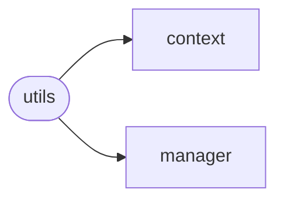
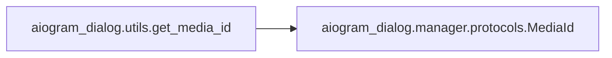
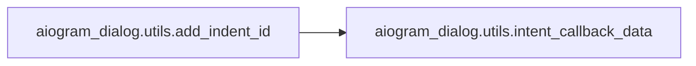

# Aiogram Dialog Utils

[_Documentation generated by Documatic_](https://www.documatic.com)

<!---Documatic-section-Codebase Structure-start--->
## Codebase Structure

<!---Documatic-block-system_architecture-start--->

<!---Documatic-block-system_architecture-end--->

# #
<!---Documatic-section-Codebase Structure-end--->

<!---Documatic-section-aiogram_dialog.utils.get_media_id-start--->
## aiogram_dialog.utils.get_media_id

<!---Documatic-section-get_media_id-start--->


### Object Calls

* aiogram_dialog.manager.protocols.MediaId

<!---Documatic-block-aiogram_dialog.utils.get_media_id-start--->
<details>
	<summary><code>aiogram_dialog.utils.get_media_id</code> code snippet</summary>

```python
def get_media_id(message: Message) -> Optional[MediaId]:
    media = message.audio or message.animation or message.document or (message.photo[-1] if message.photo else None) or message.video
    if not media:
        return None
    return MediaId(file_id=media.file_id, file_unique_id=media.file_unique_id)
```
</details>
<!---Documatic-block-aiogram_dialog.utils.get_media_id-end--->
<!---Documatic-section-get_media_id-end--->

# #
<!---Documatic-section-aiogram_dialog.utils.get_media_id-end--->

<!---Documatic-section-aiogram_dialog.utils.remove_indent_id-start--->
## aiogram_dialog.utils.remove_indent_id

<!---Documatic-section-remove_indent_id-start--->
<!---Documatic-block-aiogram_dialog.utils.remove_indent_id-start--->
<details>
	<summary><code>aiogram_dialog.utils.remove_indent_id</code> code snippet</summary>

```python
def remove_indent_id(callback_data: str) -> Tuple[Optional[str], str]:
    if CB_SEP in callback_data:
        (intent_id, new_data) = callback_data.split(CB_SEP, maxsplit=1)
        return (intent_id, new_data)
    return (None, callback_data)
```
</details>
<!---Documatic-block-aiogram_dialog.utils.remove_indent_id-end--->
<!---Documatic-section-remove_indent_id-end--->

# #
<!---Documatic-section-aiogram_dialog.utils.remove_indent_id-end--->

<!---Documatic-section-aiogram_dialog.utils.add_indent_id-start--->
## aiogram_dialog.utils.add_indent_id

<!---Documatic-section-add_indent_id-start--->


### Object Calls

* aiogram_dialog.utils.intent_callback_data

<!---Documatic-block-aiogram_dialog.utils.add_indent_id-start--->
<details>
	<summary><code>aiogram_dialog.utils.add_indent_id</code> code snippet</summary>

```python
def add_indent_id(message: NewMessage, intent_id: str):
    if not message.reply_markup:
        return
    for row in message.reply_markup.inline_keyboard:
        for button in row:
            button.callback_data = intent_callback_data(intent_id, button.callback_data)
```
</details>
<!---Documatic-block-aiogram_dialog.utils.add_indent_id-end--->
<!---Documatic-section-add_indent_id-end--->

# #
<!---Documatic-section-aiogram_dialog.utils.add_indent_id-end--->

<!---Documatic-section-aiogram_dialog.utils.is_chat_loaded-start--->
## aiogram_dialog.utils.is_chat_loaded

<!---Documatic-section-is_chat_loaded-start--->
<!---Documatic-block-aiogram_dialog.utils.is_chat_loaded-start--->
<details>
	<summary><code>aiogram_dialog.utils.is_chat_loaded</code> code snippet</summary>

```python
def is_chat_loaded(chat: Chat) -> bool:
    return getattr(chat, 'fake', False)
```
</details>
<!---Documatic-block-aiogram_dialog.utils.is_chat_loaded-end--->
<!---Documatic-section-is_chat_loaded-end--->

# #
<!---Documatic-section-aiogram_dialog.utils.is_chat_loaded-end--->

<!---Documatic-section-aiogram_dialog.utils.is_user_loaded-start--->
## aiogram_dialog.utils.is_user_loaded

<!---Documatic-section-is_user_loaded-start--->
<!---Documatic-block-aiogram_dialog.utils.is_user_loaded-start--->
<details>
	<summary><code>aiogram_dialog.utils.is_user_loaded</code> code snippet</summary>

```python
def is_user_loaded(user: User) -> bool:
    return getattr(user, 'fake', False)
```
</details>
<!---Documatic-block-aiogram_dialog.utils.is_user_loaded-end--->
<!---Documatic-section-is_user_loaded-end--->

# #
<!---Documatic-section-aiogram_dialog.utils.is_user_loaded-end--->

<!---Documatic-section-aiogram_dialog.utils.intent_callback_data-start--->
## aiogram_dialog.utils.intent_callback_data

<!---Documatic-section-intent_callback_data-start--->
<!---Documatic-block-aiogram_dialog.utils.intent_callback_data-start--->
<details>
	<summary><code>aiogram_dialog.utils.intent_callback_data</code> code snippet</summary>

```python
def intent_callback_data(intent_id: str, callback_data: Optional[str]) -> Optional[str]:
    if callback_data is None:
        return None
    return intent_id + CB_SEP + callback_data
```
</details>
<!---Documatic-block-aiogram_dialog.utils.intent_callback_data-end--->
<!---Documatic-section-intent_callback_data-end--->

# #
<!---Documatic-section-aiogram_dialog.utils.intent_callback_data-end--->

[_Documentation generated by Documatic_](https://www.documatic.com)