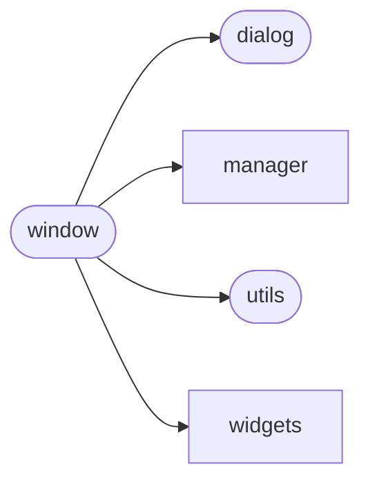

# Aiogram Dialog Window

[_Documentation generated by Documatic_](https://www.documatic.com)

<!---Documatic-section-Codebase Structure-start--->
## Codebase Structure

<!---Documatic-block-system_architecture-start--->

<!---Documatic-block-system_architecture-end--->

# #
<!---Documatic-section-Codebase Structure-end--->

<!---Documatic-section-aiogram_dialog.window.Window-start--->
## aiogram_dialog.window.Window

<!---Documatic-section-Window-start--->
<!---Documatic-block-aiogram_dialog.window.Window-start--->
<details>
	<summary><code>aiogram_dialog.window.Window</code> code snippet</summary>

```python
class Window(DialogWindowProto):

    def __init__(self, *widgets: WidgetSrc, state: State, getter: GetterVariant=None, parse_mode: Optional[str]=UNSET, disable_web_page_preview: Optional[bool]=None, preview_add_transitions: Optional[List[Keyboard]]=None, preview_data: GetterVariant=None):
        (self.text, self.keyboard, self.on_message, self.media) = ensure_widgets(widgets)
        self.getter = PreviewAwareGetter(ensure_data_getter(getter), ensure_data_getter(preview_data))
        self.state = state
        self.parse_mode = parse_mode
        self.disable_web_page_preview = disable_web_page_preview
        self.preview_add_transitions = preview_add_transitions

    async def render_text(self, data: Dict, manager: DialogManager) -> str:
        return await self.text.render_text(data, manager)

    async def render_media(self, data: Dict, manager: DialogManager) -> Optional[MediaAttachment]:
        if self.media:
            return await self.media.render_media(data, manager)

    async def render_kbd(self, data: Dict, manager: DialogManager) -> InlineKeyboardMarkup:
        keyboard = await self.keyboard.render_keyboard(data, manager)
        return InlineKeyboardMarkup(inline_keyboard=keyboard)

    async def load_data(self, dialog: 'Dialog', manager: DialogManager) -> Dict:
        data = await dialog.load_data(manager)
        data.update(await self.getter(**manager.data))
        return data

    async def process_message(self, message: Message, dialog: Dialog, manager: DialogManager):
        if self.on_message:
            await self.on_message.process_message(message, dialog, manager)

    async def process_callback(self, c: CallbackQuery, dialog: Dialog, manager: DialogManager):
        if self.keyboard:
            await self.keyboard.process_callback(c, dialog, manager)

    async def render(self, dialog: Dialog, manager: DialogManager) -> NewMessage:
        logger.debug('Show window: %s', self)
        chat = manager.data['event_chat']
        current_data = await self.load_data(dialog, manager)
        return NewMessage(chat=chat, text=await self.render_text(current_data, manager), reply_markup=await self.render_kbd(current_data, manager), parse_mode=self.parse_mode, disable_web_page_preview=self.disable_web_page_preview, media=await self.render_media(current_data, manager))

    def get_state(self) -> State:
        return self.state

    def find(self, widget_id) -> Optional[Actionable]:
        if self.keyboard:
            res = self.keyboard.find(widget_id)
            if res:
                return res
        if self.on_message:
            return self.on_message.find(widget_id)
        return None

    def __repr__(self):
        return f'<{self.__class__.__qualname__}({self.state})>'
```
</details>
<!---Documatic-block-aiogram_dialog.window.Window-end--->
<!---Documatic-section-Window-end--->

# #
<!---Documatic-section-aiogram_dialog.window.Window-end--->

[_Documentation generated by Documatic_](https://www.documatic.com)