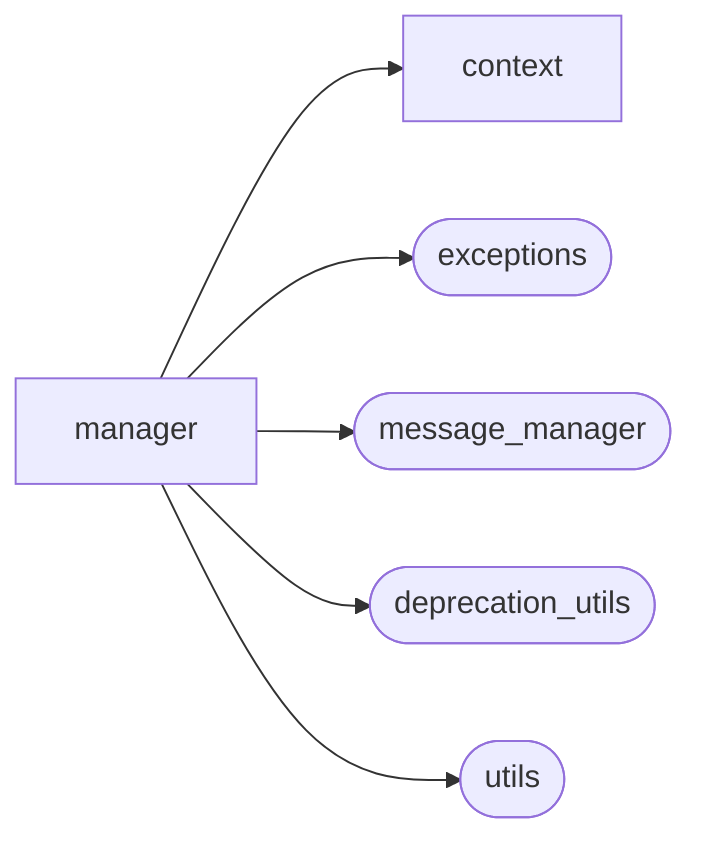

# Aiogram Dialog Manager

[_Documentation generated by Documatic_](https://www.documatic.com)

<!---Documatic-section-Codebase Structure-start--->
## Codebase Structure

<!---Documatic-block-system_architecture-start--->

<!---Documatic-block-system_architecture-end--->

# #
<!---Documatic-section-Codebase Structure-end--->

<!---Documatic-section-aiogram_dialog.manager.update_handler.handle_update-start--->
## aiogram_dialog.manager.update_handler.handle_update

<!---Documatic-section-handle_update-start--->
<!---Documatic-block-aiogram_dialog.manager.update_handler.handle_update-start--->
<details>
	<summary><code>aiogram_dialog.manager.update_handler.handle_update</code> code snippet</summary>

```python
async def handle_update(event: DialogUpdateEvent, dialog_manager: ManagerImpl):
    if isinstance(event, DialogStartEvent):
        await dialog_manager.start(state=event.new_state, data=event.data, mode=event.mode, show_mode=event.show_mode)
    elif isinstance(event, DialogSwitchEvent):
        await dialog_manager.switch_to(state=event.new_state)
        await dialog_manager.dialog().show()
    elif event.action is Action.UPDATE:
        if not dialog_manager.current_context():
            logger.warning('No context found')
            return
        if event.data:
            for (k, v) in event.data.items():
                dialog_manager.current_context().dialog_data[k] = v
        await dialog_manager.dialog().show()
    elif event.action is Action.DONE:
        await dialog_manager.done(result=event.data)
```
</details>
<!---Documatic-block-aiogram_dialog.manager.update_handler.handle_update-end--->
<!---Documatic-section-handle_update-end--->

# #
<!---Documatic-section-aiogram_dialog.manager.update_handler.handle_update-end--->

<!---Documatic-section-aiogram_dialog.manager.protocols.BaseDialogManager-start--->
## aiogram_dialog.manager.protocols.BaseDialogManager

<!---Documatic-section-BaseDialogManager-start--->
<!---Documatic-block-aiogram_dialog.manager.protocols.BaseDialogManager-start--->
<details>
	<summary><code>aiogram_dialog.manager.protocols.BaseDialogManager</code> code snippet</summary>

```python
class BaseDialogManager(Protocol):
    event: ChatEvent

    @property
    def registry(self) -> DialogRegistryProto:
        raise NotImplementedError

    async def done(self, result: Any=None) -> None:
        pass

    async def mark_closed(self) -> None:
        pass

    async def start(self, state: State, data: Data=None, mode: StartMode=StartMode.NORMAL, show_mode: ShowMode=ShowMode.AUTO) -> None:
        pass

    async def switch_to(self, state: State) -> None:
        pass

    async def update(self, data: Dict) -> None:
        pass

    def bg(self, user_id: Optional[int]=None, chat_id: Optional[int]=None, stack_id: Optional[str]=None, load: bool=False) -> 'BaseDialogManager':
        pass
```
</details>
<!---Documatic-block-aiogram_dialog.manager.protocols.BaseDialogManager-end--->
<!---Documatic-section-BaseDialogManager-end--->

# #
<!---Documatic-section-aiogram_dialog.manager.protocols.BaseDialogManager-end--->

<!---Documatic-section-aiogram_dialog.manager.registry.DialogRegistry-start--->
## aiogram_dialog.manager.registry.DialogRegistry

<!---Documatic-section-DialogRegistry-start--->
<!---Documatic-block-aiogram_dialog.manager.registry.DialogRegistry-start--->
<details>
	<summary><code>aiogram_dialog.manager.registry.DialogRegistry</code> code snippet</summary>

```python
class DialogRegistry(DialogRegistryProto):

    def __init__(self, dp: Dispatcher, dialogs: Sequence[ManagedDialogProto]=(), media_id_storage: Optional[MediaIdStorageProtocol]=None, message_manager: Optional[MessageManagerProtocol]=None, dialog_manager_factory: DialogManagerFactory=ManagerImpl, default_router: Optional[Router]=None):
        self.dp = dp
        self.update_handler = self.dp.observers[DIALOG_EVENT_NAME] = DialogEventObserver(router=self.dp, event_name=DIALOG_EVENT_NAME)
        self.default_router = default_router if default_router else dp.include_router(Router(name='aiogram_dialog_router'))
        self.dialogs = {d.states_group(): d for d in dialogs}
        self.state_groups: Dict[str, Type[StatesGroup]] = {d.states_group_name(): d.states_group() for d in dialogs}
        self.register_update_handler(handle_update, any_state)
        if media_id_storage is None:
            media_id_storage = MediaIdStorage()
        self._media_id_storage = media_id_storage
        if message_manager is None:
            message_manager = MessageManager()
        self._message_manager = message_manager
        self.dialog_manager_factory = dialog_manager_factory
        self._register_middleware()

    @property
    def media_id_storage(self) -> MediaIdStorageProtocol:
        return self._media_id_storage

    @property
    def message_manager(self) -> MessageManagerProtocol:
        return self._message_manager

    def register(self, dialog: ManagedDialogProto, *args, router: Router=None, **kwargs):
        group = dialog.states_group()
        if group in self.dialogs:
            raise ValueError(f'StatesGroup `{group}` is already used')
        self.dialogs[group] = dialog
        self.state_groups[dialog.states_group_name()] = group
        dialog.register(self, router if router else self.default_router, IntentFilter(aiogd_intent_state_group=group), *args, **kwargs)

    def register_start_handler(self, state: State):

        async def start_dialog(m: Message, dialog_manager: DialogManager):
            await dialog_manager.start(state, mode=StartMode.RESET_STACK)
        self.dp.message.register(start_dialog, Command(commands='start'), any_state)

    def _register_middleware(self):
        manager_middleware = ManagerMiddleware(self, self.dialog_manager_factory)
        intent_middleware = IntentMiddlewareFactory(storage=self.dp.fsm.storage, state_groups=self.state_groups)
        self.dp.message.middleware(manager_middleware)
        self.dp.callback_query.middleware(manager_middleware)
        self.update_handler.middleware(manager_middleware)
        self.dp.my_chat_member.middleware(manager_middleware)
        self.dp.errors.middleware(manager_middleware)
        self.dp.message.outer_middleware(intent_middleware.process_message)
        self.dp.callback_query.outer_middleware(intent_middleware.process_callback_query)
        self.update_handler.outer_middleware(intent_middleware.process_aiogd_update)
        self.dp.my_chat_member.outer_middleware(intent_middleware.process_my_chat_member)
        self.dp.message.middleware(context_saver_middleware)
        self.dp.callback_query.middleware(context_saver_middleware)
        self.update_handler.middleware(context_saver_middleware)
        self.dp.my_chat_member.middleware(context_saver_middleware)
        self.dp.errors.outer_middleware(IntentErrorMiddleware(storage=self.dp.fsm.storage, state_groups=self.state_groups))

    def find_dialog(self, state: State) -> ManagedDialogProto:
        try:
            return self.dialogs[state.group]
        except KeyError as e:
            raise UnregisteredDialogError(f'No dialog found for `{state.group}` (looking by state `{state}`)') from e

    def register_update_handler(self, callback, *custom_filters, **kwargs) -> None:
        self.update_handler.register(callback, *custom_filters, **kwargs)

    async def notify(self, bot: Bot, update: DialogUpdate) -> None:

        def callback():
            asyncio.create_task(self._process_update(bot, update))
        asyncio.get_running_loop().call_soon(callback, context=copy_context())

    async def _process_update(self, bot: Bot, update: DialogUpdate):
        event = update.event
        Bot.set_current(bot)
        User.set_current(event.from_user)
        Chat.set_current(event.chat)
        await self.dp.propagate_event(update_type='update', event=update, bot=bot, event_from_user=event.from_user, event_chat=event.chat)
```
</details>
<!---Documatic-block-aiogram_dialog.manager.registry.DialogRegistry-end--->
<!---Documatic-section-DialogRegistry-end--->

# #
<!---Documatic-section-aiogram_dialog.manager.registry.DialogRegistry-end--->

<!---Documatic-section-aiogram_dialog.manager.protocols.DialogManager-start--->
## aiogram_dialog.manager.protocols.DialogManager

<!---Documatic-section-DialogManager-start--->
<!---Documatic-block-aiogram_dialog.manager.protocols.DialogManager-start--->
<details>
	<summary><code>aiogram_dialog.manager.protocols.DialogManager</code> code snippet</summary>

```python
class DialogManager(BaseDialogManager, Protocol):
    event: ChatEvent
    data: Dict
    show_mode: ShowMode

    def is_preview(self) -> bool:
        raise NotImplementedError

    def current_context(self) -> Optional[Context]:
        raise NotImplementedError

    def current_stack(self) -> Optional[Stack]:
        raise NotImplementedError

    def dialog(self) -> ManagedDialogAdapterProto:
        raise NotImplementedError

    async def close_manager(self) -> None:
        raise NotImplementedError

    async def show(self, new_message: NewMessage) -> Message:
        raise NotImplementedError

    async def reset_stack(self, remove_keyboard: bool=True) -> None:
        raise NotImplementedError

    async def load_data(self) -> Dict:
        raise NotImplementedError
```
</details>
<!---Documatic-block-aiogram_dialog.manager.protocols.DialogManager-end--->
<!---Documatic-section-DialogManager-end--->

# #
<!---Documatic-section-aiogram_dialog.manager.protocols.DialogManager-end--->

<!---Documatic-section-aiogram_dialog.manager.protocols.MediaId-start--->
## aiogram_dialog.manager.protocols.MediaId

<!---Documatic-section-MediaId-start--->
<!---Documatic-block-aiogram_dialog.manager.protocols.MediaId-start--->
<details>
	<summary><code>aiogram_dialog.manager.protocols.MediaId</code> code snippet</summary>

```python
@dataclass
class MediaId:
    file_id: str
    file_unique_id: Optional[str] = None

    def __eq__(self, other):
        if type(other) is not MediaId:
            return False
        if self.file_unique_id is None or other.file_unique_id is None:
            return self.file_id == other.file_id
        return self.file_unique_id == other.file_unique_id
```
</details>
<!---Documatic-block-aiogram_dialog.manager.protocols.MediaId-end--->
<!---Documatic-section-MediaId-end--->

# #
<!---Documatic-section-aiogram_dialog.manager.protocols.MediaId-end--->

[_Documentation generated by Documatic_](https://www.documatic.com)