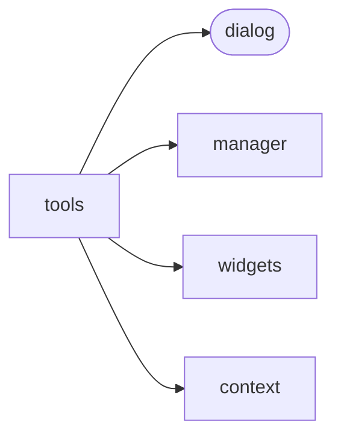
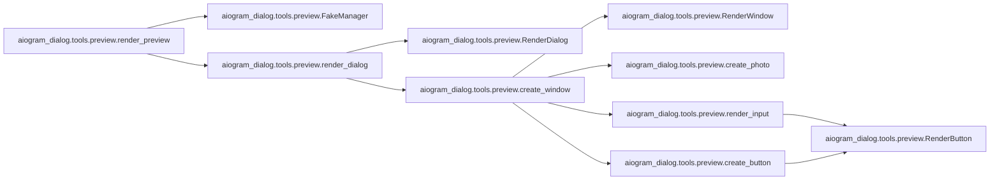
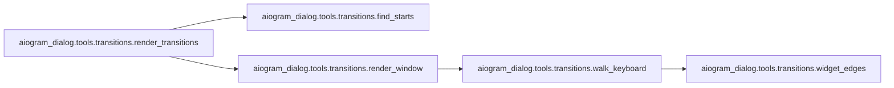
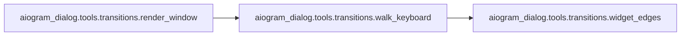
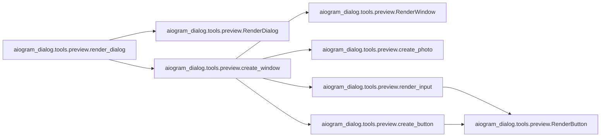

# Aiogram Dialog Tools

[_Documentation generated by Documatic_](https://www.documatic.com)

<!---Documatic-section-Codebase Structure-start--->
## Codebase Structure

<!---Documatic-block-system_architecture-start--->

<!---Documatic-block-system_architecture-end--->

# #
<!---Documatic-section-Codebase Structure-end--->

<!---Documatic-section-aiogram_dialog.tools.preview.render_preview-start--->
## aiogram_dialog.tools.preview.render_preview

<!---Documatic-section-render_preview-start--->


### Object Calls

* aiogram_dialog.tools.preview.FakeManager
* aiogram_dialog.tools.preview.render_dialog

<!---Documatic-block-aiogram_dialog.tools.preview.render_preview-start--->
<details>
	<summary><code>aiogram_dialog.tools.preview.render_preview</code> code snippet</summary>

```python
async def render_preview(registry: DialogRegistry, file: str, simulate_events: bool=False):
    fake_manager = FakeManager(registry)
    dialogs = [await render_dialog(manager=fake_manager, group=group, dialog=dialog, simulate_events=simulate_events) for (group, dialog) in registry.dialogs.items()]
    env = Environment(loader=PackageLoader('aiogram_dialog.tools'), autoescape=select_autoescape())
    template = env.get_template('message.html')
    res = template.render(dialogs=dialogs)
    with open(file, 'w') as f:
        f.write(res)
```
</details>
<!---Documatic-block-aiogram_dialog.tools.preview.render_preview-end--->
<!---Documatic-section-render_preview-end--->

# #
<!---Documatic-section-aiogram_dialog.tools.preview.render_preview-end--->

<!---Documatic-section-aiogram_dialog.tools.transitions.render_transitions-start--->
## aiogram_dialog.tools.transitions.render_transitions

<!---Documatic-section-render_transitions-start--->


### Object Calls

* aiogram_dialog.tools.transitions.find_starts
* aiogram_dialog.tools.transitions.render_window

<!---Documatic-block-aiogram_dialog.tools.transitions.render_transitions-start--->
<details>
	<summary><code>aiogram_dialog.tools.transitions.render_transitions</code> code snippet</summary>

```python
def render_transitions(dialogs: Union[List[Dialog], DialogRegistry], title: str='Aiogram Dialog', filename: str='aiogram_dialog.png', format: str='png'):
    if isinstance(dialogs, DialogRegistry):
        dialogs = list(dialogs.dialogs.values())
    with Diagram(title, filename=filename, outformat=format, show=False):
        nodes = {}
        for dialog in dialogs:
            with Cluster(dialog.states_group_name()):
                for window in dialog.windows.values():
                    nodes[window.get_state()] = Custom(icon_path=ICON_PATH, label=window.get_state().state)
        starts = []
        for dialog in dialogs:
            for window in dialog.windows.values():
                starts.extend(find_starts(window.get_state(), [window.keyboard]))
        for dialog in dialogs:
            for window in dialog.windows.values():
                render_window(nodes=nodes, dialog=dialog, window=window, starts=starts)
```
</details>
<!---Documatic-block-aiogram_dialog.tools.transitions.render_transitions-end--->
<!---Documatic-section-render_transitions-end--->

# #
<!---Documatic-section-aiogram_dialog.tools.transitions.render_transitions-end--->

<!---Documatic-section-aiogram_dialog.tools.preview.FakeManager-start--->
## aiogram_dialog.tools.preview.FakeManager

<!---Documatic-section-FakeManager-start--->
<!---Documatic-block-aiogram_dialog.tools.preview.FakeManager-start--->
<details>
	<summary><code>aiogram_dialog.tools.preview.FakeManager</code> code snippet</summary>

```python
class FakeManager(DialogManager):

    def __init__(self, registry: DialogRegistry):
        self.event = DialogUpdateEvent(from_user=User(id=1, is_bot=False, first_name='Fake'), chat=Chat(id=1, type='private'), action=Action.UPDATE, data={}, intent_id=None, stack_id=None)
        self._registry = registry
        self._context: Optional[Context] = None
        self._dialog = None
        self.data = {'dialog_manager': self, 'event_chat': Chat(id=1, type='private'), 'event_from_user': User(id=1, is_bot=False, first_name='Fake')}

    async def load_data(self) -> Dict:
        return {}

    async def close_manager(self) -> None:
        pass

    async def reset_stack(self, remove_keyboard: bool=True) -> None:
        self.reset_context()

    def set_dialog(self, dialog: Dialog):
        self._dialog = dialog
        self.reset_context()

    def set_state(self, state: State):
        self._context.state = state

    def dialog(self) -> ManagedDialogAdapterProto:
        return ManagedDialogAdapter(self._dialog, self)

    def is_preview(self) -> bool:
        return True

    def reset_context(self) -> None:
        self._context = Context(_intent_id='0', _stack_id='0', start_data={}, widget_data={}, dialog_data={}, state=State())

    async def switch_to(self, state: State) -> None:
        self.set_state(state)

    async def start(self, state: State, data: Data=None, mode: StartMode=StartMode.NORMAL, show_mode: ShowMode=ShowMode.AUTO) -> None:
        self.set_state(state)

    async def done(self, result: Any=None) -> None:
        self.set_state(State('-'))

    def current_stack(self) -> Optional[Stack]:
        return Stack()

    def current_context(self) -> Optional[Context]:
        return self._context

    async def show(self, new_message: NewMessage) -> Message:
        self.new_message = new_message
        return Message(message_id=1, date=datetime.now(), chat=Chat(id=1, type='private'))

    @property
    def registry(self) -> DialogRegistryProto:
        return self._registry
```
</details>
<!---Documatic-block-aiogram_dialog.tools.preview.FakeManager-end--->
<!---Documatic-section-FakeManager-end--->

# #
<!---Documatic-section-aiogram_dialog.tools.preview.FakeManager-end--->

<!---Documatic-section-aiogram_dialog.tools.transitions.render_window-start--->
## aiogram_dialog.tools.transitions.render_window

<!---Documatic-section-render_window-start--->


### Object Calls

* aiogram_dialog.tools.transitions.walk_keyboard

<!---Documatic-block-aiogram_dialog.tools.transitions.render_window-start--->
<details>
	<summary><code>aiogram_dialog.tools.transitions.render_window</code> code snippet</summary>

```python
def render_window(nodes: dict, dialog: Dialog, starts: List[Tuple[State, State]], window: DialogWindowProto):
    walk_keyboard(nodes, dialog, starts, window.get_state(), [window.keyboard])
    preview_add_transitions = getattr(window, 'preview_add_transitions', None)
    if preview_add_transitions:
        walk_keyboard(nodes, dialog, starts, window.get_state(), preview_add_transitions)
```
</details>
<!---Documatic-block-aiogram_dialog.tools.transitions.render_window-end--->
<!---Documatic-section-render_window-end--->

# #
<!---Documatic-section-aiogram_dialog.tools.transitions.render_window-end--->

<!---Documatic-section-aiogram_dialog.tools.preview.render_dialog-start--->
## aiogram_dialog.tools.preview.render_dialog

<!---Documatic-section-render_dialog-start--->


### Object Calls

* aiogram_dialog.tools.preview.RenderDialog
* aiogram_dialog.tools.preview.create_window

<!---Documatic-block-aiogram_dialog.tools.preview.render_dialog-start--->
<details>
	<summary><code>aiogram_dialog.tools.preview.render_dialog</code> code snippet</summary>

```python
async def render_dialog(manager: FakeManager, group: StatesGroup, dialog: Dialog, simulate_events: bool) -> RenderDialog:
    manager.set_dialog(dialog)
    windows = []
    for state in group.__states__:
        manager.set_state(state)
        await dialog.show(manager)
        windows.append(await create_window(manager=manager, state=state, dialog=dialog, message=manager.new_message, simulate_events=simulate_events))
    return RenderDialog(state_group=str(group), windows=windows)
```
</details>
<!---Documatic-block-aiogram_dialog.tools.preview.render_dialog-end--->
<!---Documatic-section-render_dialog-end--->

# #
<!---Documatic-section-aiogram_dialog.tools.preview.render_dialog-end--->

<!---Documatic-section-aiogram_dialog.tools.transitions.find_starts-start--->
## aiogram_dialog.tools.transitions.find_starts

<!---Documatic-section-find_starts-start--->
<!---Documatic-block-aiogram_dialog.tools.transitions.find_starts-start--->
<details>
	<summary><code>aiogram_dialog.tools.transitions.find_starts</code> code snippet</summary>

```python
def find_starts(current_state, keyboards: Sequence) -> Iterable[Tuple[State, State]]:
    for kbd in keyboards:
        if isinstance(kbd, Group):
            yield from find_starts(current_state, kbd.buttons)
        elif isinstance(kbd, Start):
            yield (current_state, kbd.state)
```
</details>
<!---Documatic-block-aiogram_dialog.tools.transitions.find_starts-end--->
<!---Documatic-section-find_starts-end--->

# #
<!---Documatic-section-aiogram_dialog.tools.transitions.find_starts-end--->

[_Documentation generated by Documatic_](https://www.documatic.com)